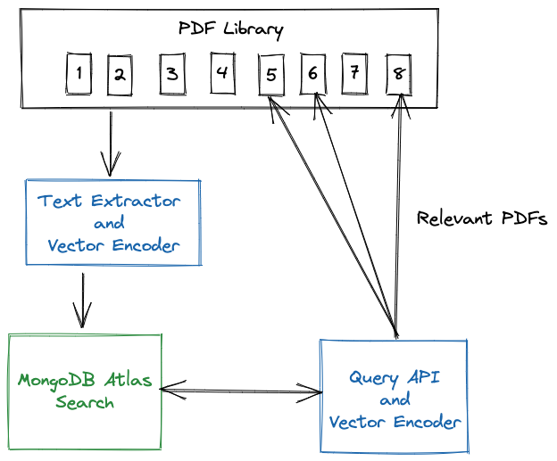

# Atlas Vector Search Across PDFs
## Introduction
This demo is a prototype of how Atlas Vector Search  could be used to find relevant PDF documents. 

To begin, the text from the PDFs are extracted, split into sentences, and mapped into a 384 dimensional dense vector space. The PDF sentences along with their vectors are stored into MongoDB Atlas.

An Atlas Vector Search index then allows the PDFs to be queried, finding the PDFs that are relevant to the query. 





## Setup
### PDFs to Query
For this demo, the text extractor reads the PDFs from a local directory. To get started, I've supplied 5 MongoDB whitepapers, but please try with your own PDFs.

### Atlas
Open [params.py](params.py) and configure your connection to Atlas, along with the name of the database and collection you'd like to store your text. 
### Extract and Encode the PDFs
Install the requirements. This implementation uses:
* [PyPDF2](https://github.com/py-pdf/PyPDF2)    Python library for text extraction
* Hugging Face [sentence-transformers/all-MiniLM-L6-v2](https://huggingface.co/sentence-transformers/all-MiniLM-L6-v2) pretrained model for the dense vector mapping
* [pymongo](https://pypi.org/project/pymongo/) - the Python driver for MongoDB

```zsh
pip install -r requirements.txt
```


Run the [extract_and_encode.py](extract_and_encode.py)
```python
python3 extract_and_encode.py
```
### Create Search Index
Create a default search index on the collection:
```json
{
  "mappings": {
    "dynamic": true,
    "fields": {
      "sentenceVector": {
        "type": "knnVector",
        "dimensions": 384,
        "similarity": "euclidean"
      }
    }
  }
}
```

## Demo
You are now ready to search your vast PDF library for the PDFs that may hold the answer to your question.

Your query will be mapped using the same sentence transformer that was used to encode the data and then submitted to Atlas Search for the name of the PDF(s) that may hold the answer.

For example:

```zsh
✗ python3 find_pdf.py -q "Can I query data that resides in AWS S3?"

Atlas Search's Top 3 Answers:
----------------------------
PDF:      MongoDB UseCase Guidance.pdf
Page:     4
Sentence: With Atlas Data Lake you can query, combine, and analyze data across AWS S3 and MongoDB Atlas Databases without complex integrations, working with data in its native format using the MongoDB Query API. 

PDF:      MongoDB Atlas Search- Transforming Customer Experience.pdf
Page:     12
Sentence: Query  and combine MongoDB Atlas  application data with other data  assets stored on Amazon S3. 

PDF:      MongoDB Atlas Search- Transforming Customer Experience.pdf
Page:     17
Sentence: Tier aged business data to S3 by using Atlas  Online Archive, then federate queries across  storage tiers via Atlas Data Lake. 

(base) ➜  vector-search-pdf git:(main) ✗ 
```

# The Search Query
This is the simple query passed to MongoDB:

```json
[
    {
        "$search": {
            "knnBeta": {
                "vector": <geneated query vector>,
                "path": "sentenceVector",
                "k": 150  // Number of neareast neighbors (nn) to return 
            }
        }
    },
    {
        "$limit": 3      
    }
]
```

The knnBeta operator uses the [Hierarchical Navigable Small Worlds](https://arxiv.org/abs/1603.09320) algorithm to perform semantic search. You can use Atlas Search support for kNN query to search similar to a selected product, search for images, etc.


